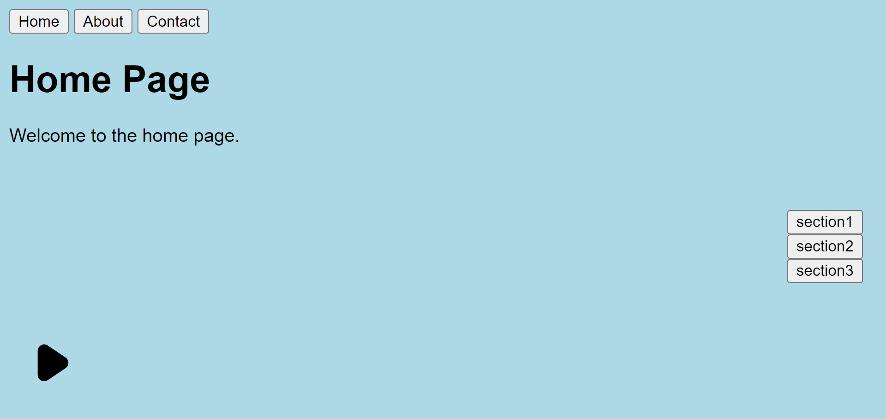

<p align="center">
  
</p>

# Single Page Application with Background Music

This project is a simple single page application (SPA) built with plain HTML, CSS, and JavaScript. It includes a background music player that continues to play while navigating between pages.

## Features

- Single Page Application without using frameworks like React or Vue.
- Background music that continues to play across different pages.
- Smooth scrolling to section anchors.
- Page-specific CSS and JavaScript loading.

## How to Run

1. Clone the repository:
    ```sh
    git clone https://github.com/Abdullah-Yilmazer/Single-Page-Application-with-Background-Music.git
    cd your-repo-name
    ```
2. Start a local server:
    - Using Python 3:
        ```sh
        python -m http.server
        ```
    - Using Node.js (http-server):
        ```sh
        npx http-server
        ```
    - Using Live Server extension in VSCode:
        - Install [Live Server](https://marketplace.visualstudio.com/items?itemName=ritwickdey.LiveServer) extension.
        - Right-click `index.html` and select `Open with Live Server`.
    - Or any server system


3. Open your browser and navigate to `http://localhost:8000` (or the address provided by your server).


## Turkish - Türkçe

Bu proje, saf HTML, CSS ve JavaScript ile oluşturulmuş basit bir tek sayfa uygulamasıdır (SPA). Sayfalar arasında gezinirken çalmaya devam eden bir arka plan müzik çaları içerir.

## Özellikler

- React veya Vue gibi frameworkler kullanmadan tek sayfa uygulaması.
- Farklı sayfalarda çalmaya devam eden arka plan müziği.
- Bölüm bağlantılarına yumuşak kaydırma.
- Sayfaya özel CSS ve JavaScript yükleme.

## Nasıl Çalıştırılır

1. Depoyu klonlayın:
    ```sh
    git clone https://github.com/Abdullah-Yilmazer/Single-Page-Application-with-Background-Music.git
    cd your-repo-name
    ```
2. Yerel bir sunucu başlatın:
    - Python 3 kullanarak:
        ```sh
        python -m http.server
        ```
    - Node.js (http-server) kullanarak:
        ```sh
        npx http-server
        ```
    - VSCode'da Live Server uzantısını kullanarak:
        - [Live Server](https://marketplace.visualstudio.com/items?itemName=ritwickdey.LiveServer) uzantısını kurun.
        - `index.html` dosyasına sağ tıklayın ve `Open with Live Server` seçeneğini seçin.
     
    - Ya da herhangi bir sunucu sistemi

3. Tarayıcınızı açın ve `http://localhost:8000` adresine gidin (veya sunucunuzun verdiği adrese).


## License

This project is licensed under the MIT License - see the [LICENSE](https://github.com/Abdullah-Yilmazer/Single-Page-Application-with-Background-Music/blob/main/LICENSE) file for details.


